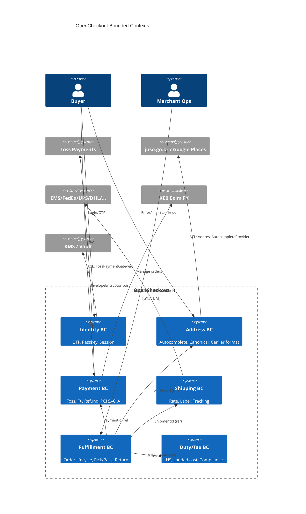

# ADR-001: Hexagonal Architecture & Aggregate Boundaries

- **Status**: Accepted
- **Date**: 2026-04-23
- **Last normalized**: 2026-04-24 (ADR-019)
- **Deciders**: `@ziho` (product/architecture), domain-research reviewer, `technical-review` red-team
- **Technical Story**: `research/08-technical-review.md` 차원 1, 8 + `prd/PRD-v0.md` §4/§5-6/§8. ADR 분리 목록 중 ADR-001에 해당.

---

## Context

PRD v0는 OSS 체크아웃 SDK를 "address + payments + (선택) checkout" 모노레포로 제안하지만, 기술 PRD 관점 적대적 리뷰에서 도메인 경계 설계가 🟡(Partial)로 평가되었다. 핵심 문제는 세 가지.

1. **Canonical Record가 3역 혼재 (역할 충돌).** 리뷰 원문:

   > "§5-6 `AddressCanonicalRecord`는 DB 스키마이자 도메인 모델이자 API schema — 세 역할 혼재. Anemic model 유발"

   실제로 PRD §5-6-2 `AddressCanonicalRecord`는 `id/version/schemaVersion`(persistence), `source.rawResponse`(raw API payload), `carrierFormats[*]`(pre-computed cache), `pii.encryptionKeyId`(infra 걱정), `audit.changeLog`(감사 기록)을 **한 타입에 전부** 올려놓았다. 이 구조로는 도메인 invariant("수신자 이름과 전화가 최소 1쌍 있어야 한다")을 enforce할 지점이 사라지고, DB 마이그레이션이 곧 도메인 모델 변경이 된다.

2. **Aggregate 경계 미정.** PRD §8-1의 이벤트 카탈로그(`order.*`, `payment.*`, `shipment.*`, `address.*`, `return.*`, `dispute.*`)는 풍부하지만 어떤 이벤트가 어떤 aggregate root를 변경하는지, cross-aggregate 트랜잭션을 어떻게 처리하는지 미정. 예: `payment.captured`가 `Order`의 상태를 동시에 바꿔야 하는가? 같은 DB 트랜잭션에서?

3. **"Hexagonal" 용어 부재.** §4 D1은 파일 배치만 규정하며 포트/어댑터 경계는 암시적. Toss/Juso/Google/캐리어 응답이 도메인까지 타고 들어갈 위험.

추가 관찰: §4 D1의 `packages/core`는 "타입·에러·idempotency·KeyScope"를 담는다고만 기술되어, domain 레이어와 application 레이어를 분리할 수 없다. §8-1은 event-sourced 쓰기 경로를 전제하므로 **aggregate root별 이벤트 버저닝**이 명확해야 한다.

## Decision Drivers

- OSS 머천트의 BYO 인프라 (PostgreSQL → 선택적으로 Kafka/EventStoreDB)
- PCI SAQ A 유지: payments 경계가 address/fulfillment와 섞이면 안 됨 (PRD §4 D7)
- 다언어 SDK: TS → Python → Go → Java (§4 D3). 도메인 규칙이 SDK 언어마다 재구현되지 않도록 application layer는 server-side에만.
- 멀티테넌시 + per-tenant KMS DEK (ADR-005 예정)
- 이벤트 소싱 기반 (§8-3) — aggregate boundary == consistency boundary == stream key
- 낮은 장벽의 OSS 기여 (biome/vitest 결정 — §4 D9)

## Considered Options

### Option A — 레이어 없는 Monolith (단일 `packages/core`)

모든 타입/로직을 `core`에 평면 배치. PRD v0의 암시적 상태와 거의 동일.
- (+) 시작이 빠름, 초기 기여자 러닝커브 낮음.
- (−) DB/API 변화가 도메인까지 파급, PCI 경계 유지 불가, Anemic model 고착, 다언어 SDK 분리 어려움. 리뷰 피드백과 정면 충돌.

### Option B — Modular Monolith with Hexagonal Ports & Adapters

DDD 기반 bounded context 6개 (Address/Payment/Shipping/Fulfillment/Identity/Duty), 각 context 내부를 domain/application/adapters 4계층으로 자르고 inbound/outbound port를 타입으로 강제.
- (+) PRD §4의 "두 모듈 + 얇은 오케스트레이터"와 일치, SAQ A 경계를 패키지 경계로 일치시킬 수 있음, 다언어 SDK는 adapters/inbound만 다시 구현하면 됨.
- (−) 기여자가 레이어 규칙을 학습해야 함, boilerplate 증가 (lint로 완화).

### Option C — Event-driven Microservices (per-context service)

각 bounded context를 별도 서비스로 배포. 
- (+) 독립 배포, 확장성.
- (−) OSS self-host 타깃(§4 D1)과 운영 복잡도 불일치, 트랜잭션 경계 분산, 초기 기여자 진입 장벽.

## Decision

**Option B — Modular Monolith + Hexagonal (Ports & Adapters) + Event Sourcing** 채택.

### 레이어 분리 규칙 (강제)

```
packages/core/
├── domain/           # pure. no I/O, no framework, no Date.now, no fetch, no ORM
│   ├── address/      #   Entity, ValueObject, Policy, DomainEvent, Invariant
│   ├── payment/
│   ├── shipment/
│   ├── order/
│   ├── identity/
│   └── duty/
├── application/      # use-case orchestrator, transaction script, saga definition
│   ├── commands/     #   PlaceOrder, CapturePayment, PurchaseLabel, IssueRefund
│   ├── queries/      #   projection readers (CQRS read side)
│   └── sagas/        #   PaymentCapturedToOrderConfirmed, RefundOnReturnReceived
├── adapters/
│   ├── inbound/      # HTTP handler (Hono), Webhook receiver, CLI, Queue consumer
│   └── outbound/     # PostgresRepo, TossClient, JusoClient, CarrierClient, KmsClient, Clock, IdGen
└── infrastructure/   # config, bootstrap, DI wiring, OpenTelemetry init
```

**Lint-enforced rules** (dependency-cruiser 또는 eslint-plugin-boundaries):

- `domain/**` → `application/**`·`adapters/**`·`infrastructure/**` import **금지**
- `application/**` → `adapters/**` 구체 클래스 import **금지** (port 인터페이스만)
- `adapters/outbound/**`의 port 구현체는 반드시 `application/ports/*.ts`의 인터페이스를 implement
- `domain/**`에서 `Date`, `Math.random`, `fetch`, `process.env` **금지** — `Clock`/`IdGen` 포트로 주입

### TypeScript 포트 계약 예시

```ts
// application/ports/AddressRepository.ts
export interface AddressRepository {
  findById(tenantId: TenantId, id: AddressId): Promise<Address | null>;
  save(address: Address): Promise<void>; // emits DomainEvents
}

// application/ports/ShippingRateProvider.ts  (outbound port)
export interface ShippingRateProvider {
  readonly carrierCode: CarrierCode;
  quote(input: RateQuoteInput): Promise<RateQuote>;
}

// adapters/outbound/carriers/FedexShippingRateProvider.ts
export class FedexShippingRateProvider implements ShippingRateProvider {
  readonly carrierCode = "fedex" as const;
  constructor(private readonly http: HttpClient, private readonly acl: FedexAcl) {}
  async quote(input: RateQuoteInput): Promise<RateQuote> {
    const fedexReq = this.acl.toFedex(input);          // ACL: domain → vendor
    const raw = await this.http.post("/rate", fedexReq);
    return this.acl.fromFedex(raw);                    // ACL: vendor → domain
  }
}
```

### Aggregate 경계 확정

> **ADR-019 정규화 적용 (2026-04-24)**: 후속 ADR들은 문서 frontmatter에 `aggregates_touched: [...]` 필드로 다루는 aggregate를 명시한다 (ADR-019 §3.10 참조). 신규 aggregate 추가/제거는 본 표 + ADR-019 §3.10 amendment 동시 수정.

| Aggregate Root | 독립 AR | Invariants | 타 AR 참조 | Cross-AR 일관성 |
|---|---|---|---|---|
| **Order** | Yes | 총액 ≥ 0; 상태는 DAG(`draft→pending→confirmed→fulfilling→closed`)만; `lines.length ≥ 1`; 동일 `orderId`의 idempotency 키 재사용 거부 | `PaymentId`, `ShipmentId`, `AddressId`, `DutyQuoteId` — **ID only** | Saga `PaymentCapturedToOrderConfirmed` (eventual) |
| **Payment** | Yes | `captured ≤ authorized`; `refunded ≤ captured`; currency는 Toss MID와 일치; `paymentKey` 불변 | `OrderId` — **ID only** | Outbox → `payment.captured` → Order saga |
| **Shipment** | Yes | 최소 1 `Package`; carrier 선택 시 라인 길이 ≤ 해당 carrier 제약; `labelPurchased` 이후 수신자 변경 금지 | `OrderId`, `AddressId` (snapshot) | `label.purchased` → `Order.markFulfilling` via saga |
| **Address** | Yes | 국가별 필수 필드 (`recipient.name`, `phoneE164`); postalCode 포맷 일치; `taxIdentifiers` 체크섬 통과 | `TenantId`, `ownerUserId?` | 주소 변경은 Shipment 라벨 발급 후 **금지** (§8 high-risk flow) |
| **Subscription** | Yes (Phase 2) | billingKey 존재 시에만 `active`; dunning 스케줄 단조 증가 | `OrderId[]`, `PaymentMethodId` | `subscription.renewed` → 새 `Order` aggregate 생성 |
| **DutyQuote** | Yes | `expiresAt > now`; HS code 유효; `totalKRW ≥ 0` | `OrderId` | 만료 시 `order.placed` 차단 (invariant in application layer) |

**규칙** (Vernon, *Implementing DDD* Ch.10):

1. 하나의 트랜잭션 = 하나의 aggregate.
2. cross-aggregate 일관성은 **eventual** (outbox → event bus → saga/process-manager).
3. aggregate 간 참조는 **ID only**. 필요 시 snapshot을 value object로 복사 (예: Shipment에 AddressSnapshot).
4. Domain event는 aggregate root가 발행, outbox(§8-3)에 원자적으로 커밋.

### Bounded Contexts 지도 (C4 Context)



### Anti-Corruption Layer (ACL) 규칙

Toss/Juso/Kakao/Google Places/캐리어/exim 응답은 **adapter 경계에서 반드시 번역**한다. 도메인·application 레이어는 vendor payload 타입을 절대 import하지 않는다.

- ACL 위치: `adapters/outbound/<vendor>/<Vendor>Acl.ts`
- 번역 단방향: `toVendorRequest(domainInput)` / `toDomainResult(vendorResponse)`
- 원본 응답(`source.rawResponse` — PRD §5-6-2)은 **adapter 레벨 `RawResponseArchive` 포트**로 별도 저장. 도메인 Aggregate에는 `sourceProvenance: { provider, retrievedAt, rawResponseHash }` 메타만 보관.
  - 이로써 PRD `AddressCanonicalRecord`의 3역 혼재 해소: DB record = adapter persistence model, API DTO = inbound adapter schema, Domain Address = aggregate.
- rawResponse 무기한 보관 충돌(리뷰 인용 "right to erasure와 정면 충돌")은 ADR-009에서 crypto-shred로 해결, 본 ADR은 "원본은 도메인이 아니다" 만 확정.

### 패키지 구조 업데이트 (§4 D1 보강)

`@opencheckout/core`를 아래처럼 서브엔트리로 분리한다(`package.json` `exports`):

```
@opencheckout/core
 ├── /domain            → packages/core/src/domain        (pure)
 ├── /application       → packages/core/src/application   (depends domain + ports)
 ├── /ports             → packages/core/src/application/ports  (re-export)
 └── /testing           → packages/core/src/testing       (in-memory adapters)
```

- `@opencheckout/address`, `@opencheckout/payments`는 `core/domain` + `core/application`을 **내부**에서 쓰고, 공개 API는 use-case 경계만 노출.
- `packages/adapters-*`는 `core/ports`만 의존. 도메인/application 직접 import 금지.
- `services/gateway`는 `core/application` + `adapters-*`를 wiring하는 infrastructure composition root.

## Consequences

**Positive**
- Domain invariant가 한 곳 (aggregate root의 명령 메서드)에만 존재 → 다언어 SDK는 application layer 재구현 없이 adapters/inbound만 포팅.
- PCI SAQ A 경계가 패키지 경계(`@opencheckout/payments` 하위 adapters/outbound)로 고정.
- Event sourcing(§8)과 aggregate가 1:1 매핑 → stream key = `aggregateType:aggregateId`.
- Vendor 교체(Toss → 2차 PG, Juso → Kakao)가 adapter 교체로 종결, 도메인 무변.
- Anemic model 위험 해소 (리뷰 피드백 해결).

**Negative**
- 기여자 러닝커브: 레이어 규칙·ACL 개념 문서화 필요 (→ Implementation Checklist에 담음).
- 초기 boilerplate 증가 (port 인터페이스, ACL 매퍼). Biome/ts-morph 스캐폴더로 완화.
- 레이어 규칙 린트가 실패하면 CI 빨개짐 — 교육 비용.

**Neutral**
- CQRS read side(§8-2 5 view)는 application/queries + 별도 projection worker로 분리되어, write 경로와 분리됨. 추가 ADR 필요 없음.
- Phase 2 마이크로서비스 분할 시에도 context 경계가 이미 physical하게 분리되어 재작업 적음.

## Implementation Checklist

- [ ] `packages/core`에 `domain/ application/ adapters/ infrastructure/` 4-layer 스캐폴딩 추가
- [ ] `eslint-plugin-boundaries` 또는 `dependency-cruiser` 설정으로 레이어 import 방향 강제
- [ ] `Clock`, `IdGen`, `Uuid` 포트 정의 및 domain 내 `Date`/`Math.random` 사용 금지 lint rule
- [ ] Aggregate 6종(`Order`/`Payment`/`Shipment`/`Address`/`Subscription`/`DutyQuote`) Entity 클래스 + invariant 테스트
- [ ] 각 aggregate root에 `pullDomainEvents()` 구현 + outbox 기록 훅
- [ ] Saga 인터페이스(`ProcessManager`) 및 `PaymentCapturedToOrderConfirmed` 기본 구현
- [ ] ACL 모듈: `TossAcl`, `JusoAcl`, `GooglePlacesAcl`, `FedexAcl`, `EmsAcl`, `ExImFxAcl`
- [ ] `AddressCanonicalRecord`를 세 타입으로 분리: `Address`(domain) / `AddressRow`(persistence) / `AddressDTO`(API)
- [ ] `source.rawResponse`를 `RawResponseArchive` 포트로 분리, 도메인에는 hash/meta만 보관
- [ ] `package.json` `exports` 서브엔트리(`/domain`, `/application`, `/ports`, `/testing`) 설정
- [ ] `docs/architecture/layering.md`에 이 ADR 요약 + 기여자 가이드 작성
- [ ] ArchUnit-like 테스트 (`packages/core/__architecture__/*.test.ts`)로 규칙 회귀 방지
- [ ] CI에 boundary lint + architecture test 게이트 추가

## Open Questions

1. **Order가 Fulfillment BC에 속하는가, 별도 Ordering BC인가?** 현재 Fulfillment BC에 귀속했으나 Phase 2에서 Ordering이 분리될 가능성. 기준: Order가 pick/pack 이전에 비즈니스 룰을 얼마나 갖느냐.
2. ~~**Shipment의 AddressSnapshot을 value object copy로 두는 시점**~~ — **CLOSED 2026-04-24 by ADR-019 §3.11**: `label.purchased` 이벤트 payload에 immutable AddressSnapshot 포함. 이후 Address update는 Shipment에 non-propagating.
3. **DutyQuote를 Payment BC 내 value object로 격하할 여지**: 독립 수명주기(만료/재견적)가 있어서 현재 aggregate로 유지. 변경 시 saga 불필요해지는 장점 vs invariant 소실의 단점.
4. **Subscription이 Payment BC인가 별도 Subscription BC인가**: Phase 2 설계 시 재검토. 현재 Payment BC 산하로 둠.
5. **Projection rebuild 시 도메인 버전 드리프트 처리**: `schemaVersion` 필드를 event payload에 두고 up-caster chain 적용 (ADR-002 idempotency/ADR와 함께 확정).

---

## References

- Alistair Cockburn, "Hexagonal Architecture" (ports & adapters): <https://alistair.cockburn.us/hexagonal-architecture/>
- Vaughn Vernon, *Implementing Domain-Driven Design*, Ch. 10 "Aggregates" + Ch. 13 "Integrating Bounded Contexts"
- Martin Fowler, "BoundedContext": <https://martinfowler.com/bliki/BoundedContext.html>
- Martin Fowler, "AnemicDomainModel": <https://martinfowler.com/bliki/AnemicDomainModel.html>
- Chris Richardson, "Saga Pattern": <https://microservices.io/patterns/data/saga.html>
- PRD-v0 §4, §5-6, §8 (internal)
- research/08-technical-review.md 차원 1, 8 (internal)
