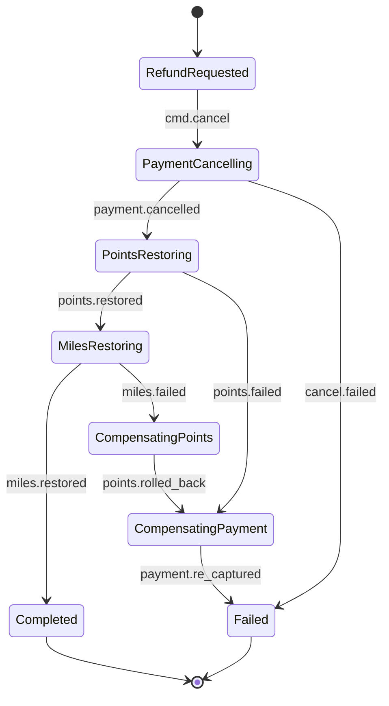

# ADR-002: Idempotency, Saga, and Effectively-Once Semantics

**Status**: Proposed
**Date**: 2026-04-23
**Last normalized**: 2026-04-24 (ADR-019)
**aggregates_touched**: [Payment, Order]
**Deciders**: gateway/payments/webhooks owners
**Supersedes**: PRD-v0 §4 D5 (단일 문장 "Idempotency-Key UUIDv4 필수, 24h 캐시")
**Related**: ADR-001 (Hexagonal layering), ADR-006 (Observability), ADR-013 (Concurrency), ADR-014 (Data Integrity — HMAC canonical), ADR-019 (Cross-ADR Normalization)

## 1. Context

PRD-v0 §4 D5는 멱등성을 단 한 줄로 기술한다:

> `Idempotency-Key`(UUIDv4) 필수, 24h 캐시.

이 한 줄은 다음 8가지 운영 상황을 규정하지 못한다:

1. **저장 스키마가 없음** — 어디에, 어떤 키로, 무엇을 저장하는가. payload hash는?
2. **동일 키 + 다른 페이로드** 처리 정책 미정의 — Stripe는 409, Square는 422, 우리는?
3. **단일 TTL 24h** — 환불은 최대 6개월(Toss), 구독 renew는 월 단위, webhook 재전송은 Toss가 최대 7일. 한 숫자로 커버 불가.
4. **다단계 거래 보상** — 포인트/마일리지 일부 적립 후 PG 취소 실패 시 어디까지 되돌리는가.
5. **Webhook 중복 수신** — Toss는 재전송을 보증하므로 같은 이벤트가 3~N번 들어옴.
6. **Projection 재빌드** — Event-sourced 뷰 재생 시 외부 side-effect가 재실행되면 이중 결제.
7. **지연 웹훅** — N시간 후 도착한 `payment.approved`가 이미 취소된 주문 상태를 덮어쓰는 경우.
8. **Outbox 구현체** — §4 D9가 "Postgres + outbox + LISTEN/NOTIFY"를 선언하나 스키마·실패 시 폴백이 없음.

결제 SDK는 단일 실패가 중복청구/환불누락/규제 노출로 직결되므로 위 8개 축을 모두 확정한 뒤 착수한다.

## 2. Decision Summary

다음 7개 축으로 분할 설계한다:

1. Idempotency Key 저장소 (PostgreSQL, `idempotency_records`)
2. Operation-type-scoped TTL 매트릭스
3. Payload Hash Mismatch → `409 + X-Idempotency-Mismatch` 규약
4. Saga Orchestration (결제/환불 보상 시퀀스)
5. Webhook Inbox Pattern (`webhook_inbox` + 서명/event_id dedup)
6. Projection Dedup (`(event_id, projection_name)` unique)
7. Outbox Pattern (Postgres LISTEN/NOTIFY + 60s polling 폴백)

## 3. Idempotency Storage Schema (PostgreSQL)

```sql
CREATE TYPE idempotency_status AS ENUM ('pending','completed','failed');

CREATE TABLE idempotency_records (
  tenant_id       UUID        NOT NULL,
  key             TEXT        NOT NULL,
  operation_type  TEXT        NOT NULL,
  payload_hash    TEXT        NOT NULL,
  status          idempotency_status NOT NULL,
  response_body   JSONB,
  status_code     INT,
  request_id      UUID        NOT NULL,
  locked_by       TEXT,
  locked_until    TIMESTAMPTZ,
  created_at      TIMESTAMPTZ NOT NULL DEFAULT now(),
  completed_at    TIMESTAMPTZ,
  expires_at      TIMESTAMPTZ NOT NULL,
  PRIMARY KEY (tenant_id, key)
);

CREATE INDEX idem_expires_idx ON idempotency_records (expires_at);
CREATE INDEX idem_pending_idx ON idempotency_records (status, locked_until)
  WHERE status = 'pending';
```

- RLS는 `tenant_id` 기반 (ADR-005 참조)
- `canonical_json`: 키 정렬 + 공백 제거 + UTF-8 NFC
- 만료 레코드는 하루 1회 `pg_cron`으로 파기 (감사 필요 레코드는 archive 테이블로 이동)

### 3-1. 서버 처리 의사 코드

```ts
async function withIdempotency<T>(
  tenantId: string,
  key: string,
  operation: OperationType,
  body: unknown,
  exec: () => Promise<Response<T>>,
): Promise<Response<T>> {
  const payloadHash = sha256(canonicalJson(body));
  const ttl = TTL_MATRIX[operation];

  const existing = await db.tx(async (tx) => {
    const row = await tx.query(`
      INSERT INTO idempotency_records
        (tenant_id,key,operation_type,payload_hash,status,request_id,expires_at,locked_by,locked_until)
      VALUES ($1,$2,$3,$4,'pending',$5, now()+$6::interval, $7, now()+'30s')
      ON CONFLICT (tenant_id,key) DO UPDATE SET key = EXCLUDED.key
      RETURNING *`,
      [tenantId, key, operation, payloadHash, requestId, ttl, workerId]);
    return row;
  });

  if (existing.payload_hash !== payloadHash) {
    throw new IdempotencyMismatch(existing, payloadHash); // -> 409
  }
  if (existing.status === 'completed') {
    return replay(existing.response_body, existing.status_code);
  }
  if (existing.status === 'pending' && existing.locked_by !== workerId) {
    throw new IdempotencyInFlight(); // -> 409 Conflict, retry-after
  }

  const result = await exec();
  await db.query(`
    UPDATE idempotency_records SET status='completed',
      response_body=$3, status_code=$4, completed_at=now()
    WHERE tenant_id=$1 AND key=$2`, [tenantId, key, result.body, result.status]);
  return result;
}
```

## 4. TTL Matrix

> **ADR-019 정규화 적용 (2026-04-24)**: 본 §4는 **Axis A (Idempotency retry window)** 전용. 가격 유효(Axis B: FX 30m/Duty 15m)·감사 보관(Axis C: WORM 7y/Merkle 10y)은 ADR-019 §3.4 참조. 세 축은 독립 저장소·독립 cron으로 분리, 한 축의 만료가 다른 축을 삭제하지 않음.

**Axis A — Idempotency retry window**

| Operation | TTL | 근거 |
|---|---|---|
| `payment.confirm` | **24h** | 카드 승인 라이프사이클, Stripe 동일 |
| `payment.cancel`, `payment.refund` | **영구 (refundId 기반)** | Toss 환불 최대 6개월. 재시도 키는 `refund.{refundId}` 주소화 — TTL 제약 없음 (ADR-019 §3.4) |
| `subscription.renew` | **7d** | 월·주 주기 재시도 Dunning (1/3/7/14d) 중 대부분 커버 |
| `webhook.delivery` | **30d** | Toss webhook 재전송 최대 7일 + 클라 재처리 버퍼 |
| `address.create`, `address.update` | **1h** | idempotency 가치 대비 저장 비용 |
| `duty.quote` | **30m** | 환율/세율 만료 창 일치 (PRD §5-10-2 `expiresAt`) |

TTL은 `config/idempotency.yaml`에서 tenant 단위 override 허용, 단 하한은 위 값.

## 5. Key + Different Payload → 409 Conflict

```
HTTP/1.1 409 Conflict
Content-Type: application/problem+json
X-Idempotency-Mismatch: payload
X-Idempotency-Original-Request-Id: 01HX...

{
  "type":"https://errors.opencheckout.dev/idempotency/mismatch",
  "title":"Idempotency-Key replayed with different payload",
  "status":409,
  "detail":"Key 'a2f8-...' was first used for a different payload hash. Use a new key for a different request.",
  "expected_hash":"sha256:8f1d...",
  "received_hash":"sha256:912c..."
}
```

`X-Idempotency-Mismatch` 값은 `payload` | `operation` | `in-flight` | `expired` 4종.

### cURL 예시

```bash
# 1st call
curl -X POST https://api.opencheckout.dev/v1/payments/confirm \
  -H "Idempotency-Key: 01HXABCDEF" \
  -H "Content-Type: application/json" \
  -d '{"paymentKey":"pk_1","orderId":"o_1","amount":{"total":100000,"currency":"KRW"}}'
# -> 200 OK

# 2nd call, same key, same body -> replay
curl -X POST ... -H "Idempotency-Key: 01HXABCDEF" -d '{same body}'
# -> 200 OK (cached response), X-Idempotency-Replay: true

# 3rd call, same key, DIFFERENT body -> 409
curl -X POST ... -H "Idempotency-Key: 01HXABCDEF" -d '{"amount":{"total":200000}}'
# -> 409, X-Idempotency-Mismatch: payload
```

## 6. Saga Design — Refund Compensation

환불은 "PG 취소 → 포인트 복원 → 마일리지 복원"의 다단계 트랜잭션이며, 로컬 트랜잭션으로 묶을 수 없다(외부 시스템). Chris Richardson의 Orchestrator-based Saga 채택.

### 6-1. 상태기계



### 6-2. 보상 매트릭스

| Step | Forward | 실패 시 Compensation | 멱등키 |
|---|---|---|---|
| 1. `payment.cancel` | Toss `POST /v1/payments/{k}/cancel` | (없음 — 시작점) | `refund.saga.{id}.cancel` |
| 2. `points.restore` | points svc `+N` | `points.compensate` (`-N`) → `payment.recapture`(가능 시) | `refund.saga.{id}.points` |
| 3. `miles.restore` | miles svc `+M` | `miles.compensate`(`-M`) → step2 보상 → step1 보상 | `refund.saga.{id}.miles` |

- 각 step은 자체 idempotency key로 재시도 안전
- Saga 상태는 `saga_instances(id, type, state, current_step, payload, created_at, updated_at)` 테이블에 저장
- 보상 불가 단계(예: 재승인 불가): `Failed + manual_review` 큐로 이동
- 타임아웃: step당 30s, 전체 saga 300s. 초과 시 보상 트리거

### 6-3. TypeScript 인터페이스

```ts
interface SagaStep<In, Out> {
  name: string;
  idempotencyKeyFor(ctx: SagaContext): string;
  forward(input: In, ctx: SagaContext): Promise<Out>;
  compensate(input: In, output: Out | null, ctx: SagaContext): Promise<void>;
  timeoutMs: number;
}

interface SagaOrchestrator<State> {
  run(instanceId: string, steps: SagaStep<any, any>[]): Promise<State>;
  resume(instanceId: string): Promise<State>;       // 크래시 복구
  compensate(instanceId: string, fromStep: number): Promise<void>;
}
```

## 7. Webhook Inbox Pattern

```sql
CREATE TABLE webhook_inbox (
  id              UUID PRIMARY KEY,
  tenant_id       UUID NOT NULL,
  source          TEXT NOT NULL,                 -- 'toss' | 'internal' | ...
  event_id        TEXT NOT NULL,
  event_type      TEXT NOT NULL,
  event_time      TIMESTAMPTZ NOT NULL,
  signature       TEXT NOT NULL,
  raw_payload     JSONB NOT NULL,
  processed_at    TIMESTAMPTZ,
  processing_error TEXT,
  received_at     TIMESTAMPTZ NOT NULL DEFAULT now(),
  UNIQUE (source, event_id)                      -- dedup
);
```

> **ADR-019 정규화 적용 (2026-04-24)**: HMAC 서명 포맷·알고리즘·nonce/kid 규격은 **@see ADR-014 §3** (canonical source). 본 섹션은 inbox 저장·dedup 규칙만 정의.

처리 순서:
1. HMAC 서명 검증 실패 → 401 (포맷: `OC-Signature`, ADR-014 §3)
2. `INSERT ... ON CONFLICT (source,event_id) DO NOTHING` → affected rows=0이면 **중복** → 200 OK + `X-Webhook-Duplicate: true`
3. 성공 시 outbox로 도메인 이벤트 발행
4. 처리 실패 시 `processed_at=null` 유지, DLQ 워커가 재시도 (지수 백오프, max 24 attempts)

## 8. Projection Dedup

```sql
CREATE TABLE projection_cursors (
  projection_name TEXT NOT NULL,
  event_id        UUID NOT NULL,
  applied_at      TIMESTAMPTZ NOT NULL DEFAULT now(),
  PRIMARY KEY (event_id, projection_name)
);
```

External side-effect(예: email 발송)를 일으키는 projection은 **반드시** 이 dedup을 먼저 통과한 뒤 side-effect를 트리거.

## 9. Late Webhook Conflict Rules

> **ADR-019 정규화 적용 (2026-04-24)**: 본 표는 **@see ADR-019 §3.3** (canonical)으로 대체. Policy는 **transition-guard-first + event_time tiebreaker** (동일 상태 허용 시에만). 기존의 `payment.cancelled` last-write-wins 규칙은 폐기 — `order.canceled` 웹훅이 `delivered/completed` 상태를 덮어쓸 수 없음 (guard reject → `conflict_log` + human review). Canonical 상태 enum은 ADR-019 §3.1 참조 (`authorized/captured/settled/voided/refunded/partially_refunded/failed`).

구현: `application/policies/WebhookTransitionPolicy.ts` 단일 선언적 매핑 파일. 상태 저장 시 `expected_prev_state`를 조건으로 `UPDATE ... WHERE prev_state = ?` (optimistic lock, ADR-013 §4 연계).

## 10. Outbox Pattern — LISTEN/NOTIFY + Polling Fallback

```sql
CREATE TABLE outbox (
  id           BIGSERIAL PRIMARY KEY,
  tenant_id    UUID NOT NULL,
  aggregate_id UUID NOT NULL,
  event_id     UUID NOT NULL UNIQUE,
  event_type   TEXT NOT NULL,
  payload      JSONB NOT NULL,
  created_at   TIMESTAMPTZ NOT NULL DEFAULT now(),
  published_at TIMESTAMPTZ,
  attempts     INT NOT NULL DEFAULT 0
);

CREATE INDEX outbox_unpub_idx ON outbox (created_at) WHERE published_at IS NULL;
```

Trigger on insert: `NOTIFY outbox_new, <id>`. 폴백: 60s 주기 폴러가 `SELECT ... FOR UPDATE SKIP LOCKED`.

## 11. At-least-once vs "Effectively-once"

순수 exactly-once는 two-generals 한계로 불가능(Pat Helland). OpenCheckout은 **at-least-once delivery + idempotent consumers = effectively-once processing** 채택.

1. Producer exactly-once 쓰기: outbox + 로컬 트랜잭션 원자성
2. At-least-once transport: broker/HTTP 재시도
3. Consumer dedup: `webhook_inbox`, `projection_cursors`, `idempotency_records`, saga step 키 — 4중 방어
4. Side-effect compensation: saga

## 12. References

- Pat Helland, *Idempotence Is Not a Medical Condition* (ACM Queue, 2012)
- Pat Helland, *Life Beyond Distributed Transactions* (CIDR 2007)
- Gregor Hohpe, *Enterprise Integration Patterns*
- Chris Richardson, *Microservices Patterns* Ch.4
- Stripe API Reference — Idempotency-Key header spec
- AWS SQS FIFO — MessageDeduplicationId

## 13. Consequences

**긍정**: 결제/환불/구독/웹훅 4대 경로 재시도·중복 체계적 방어. 감사 가능. 단일 Postgres v1 커버.
**부정**: `idempotency_records` + `webhook_inbox` + `outbox` 3개 대형 테이블 쓰기 증가. 30일 webhook_inbox 수십GB → 파티셔닝 필수. Saga orchestrator Phase 1 복잡도 +1.

## 14. Implementation Checklist

- [ ] `idempotency_records` 스키마 + `withIdempotency` 미들웨어
- [ ] `TTL_MATRIX` 상수 + config override
- [ ] `X-Idempotency-Mismatch` 응답 포맷 RFC 7807 준수
- [ ] `saga_instances` + refund saga orchestrator
- [ ] `webhook_inbox` + HMAC 검증 + dedup
- [ ] `projection_cursors` + 재빌드 플레이북 (TDD-02)
- [ ] `outbox` + LISTEN/NOTIFY + 60s polling fallback
- [ ] Late-webhook 규칙 이벤트 타입별 선언적 매핑 파일
- [ ] Partition 정책(`webhook_inbox` month, `outbox` week)
- [ ] Chaos test: 중복 webhook 1000건, network partition, worker crash mid-saga

## 15. Open Questions

1. Saga timeout 후 manual review UI — ADR-006 대시보드 포함 여부
2. Webhook replay 윈도 — ADR-003과 분담
3. Multi-region 시 `idempotency_records` PK 충돌 — ADR-007 연계
4. `billingKey` 기반 구독 renew 멱등키 규칙
