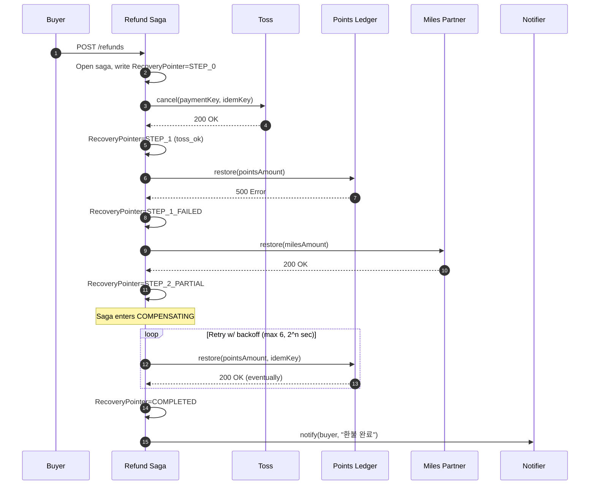
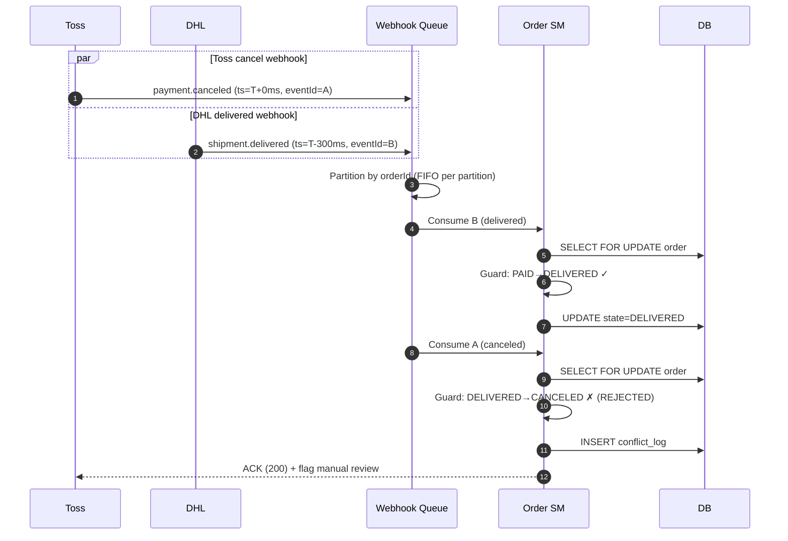
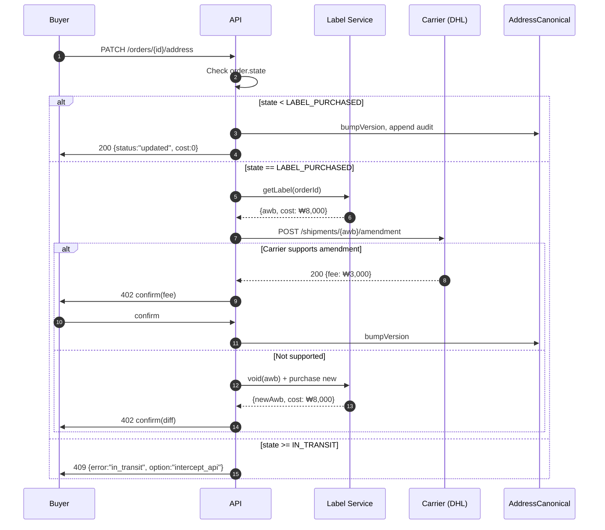
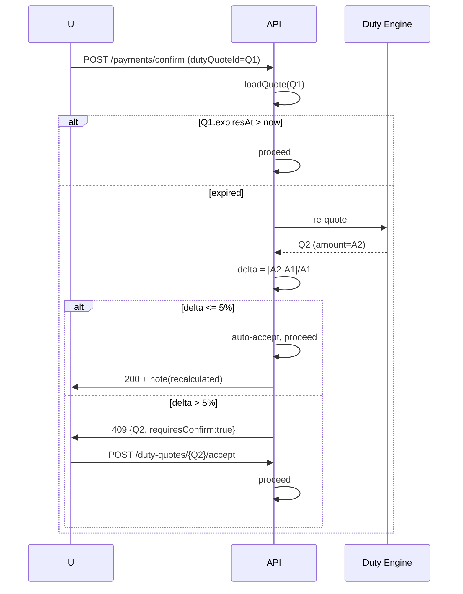
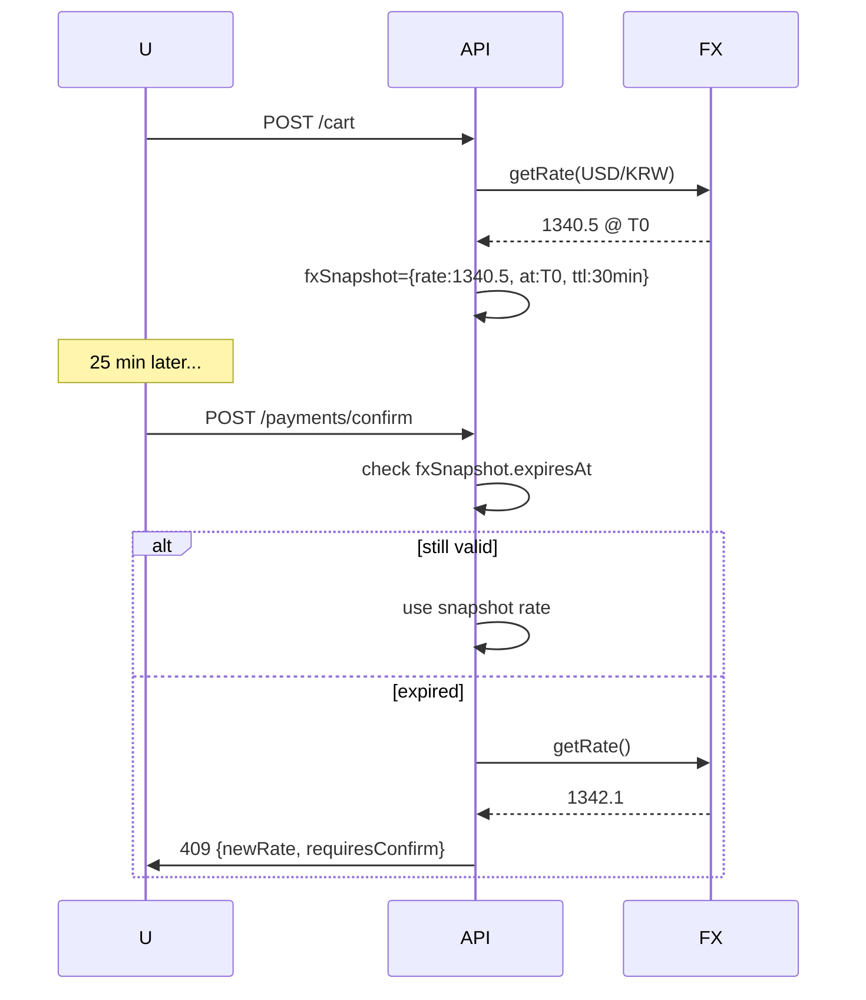
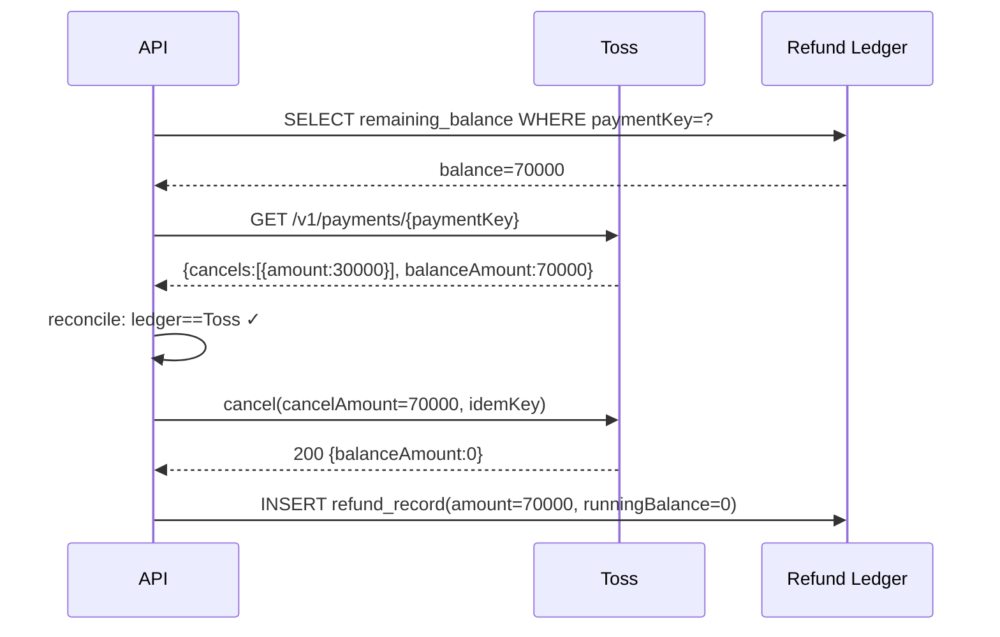

# ADR-012: 고위험 경쟁조건 시나리오 및 보상 규칙

- **Status**: Accepted
- **Date**: 2026-04-23
- **Last normalized**: 2026-04-24 (ADR-019)
- **aggregates_touched**: [Order, Payment, Address, Shipment]
- **Deciders**: Payments Team, Logistics Team, Platform SRE
- **Scope**: PRD §5-9 (환불), §5-10 (웹훅), §6-4 (주소변경), §8 (관세), §9-4 (FX), review 차원 17
- **Related**: ADR-002 (Saga/Idempotency), ADR-013 (Concurrency), ADR-014 (Integrity)

## Context

OpenCheckout은 Toss Payments 결제, 다중 캐리어 배송(DHL/FedEx), 마일리지/포인트 동시 사용, 국경 간 관세/환율 견적을 단일 주문 라이프사이클에 묶는다. 이들은 서로 다른 3rd-party의 eventual consistency 위에 놓이며, 단일 DB 트랜잭션으로 원자화 불가능. 본 ADR은 운영 중 재현되었거나 재현될 수 있는 7개 고위험 경쟁조건에 대해 Saga 보상 규칙, 상태기계 transition guard, 재무 정합 테스트를 표준화.

## Decision Summary

| # | 시나리오 | 핵심 전략 |
|---|---------|---------|
| 1 | 환불 재입금 순서 실패 | Saga + recovery pointer, buyer notification 지연 |
| 2 | 복수 웹훅 동시 도착 | 이벤트별 writer policy 분리 + transition guard |
| 3 | 주소 변경 (라벨 구매 전/후) | Label-state-aware routing, AWB amendment 조건부 |
| 4 | 관세 견적 만료 | ±5% 밴드 자동 / 초과 시 재확인 강제 |
| 5 | Toss confirm timeout | Reconcile polling + idempotency key |
| 6 | FX 업데이트 중 결제 | fxSnapshot (30분 TTL) |
| 7 | 부분 환불 후 전체 환불 | Running balance ledger + cancel history reconcile |

---

## Scenario 1: 환불 재입금 순서 실패 (Saga 부분 실패 보상)

### 문제
환불은 3개 자산(Toss 카드 승인액, 포인트, 마일)에 걸쳐 일어남. 원자성 불가.

### Sequence Diagram



### 보상 규칙
- **Forward**: `toss.cancel → points.restore → miles.restore` (신뢰도 역순)
- **Backward 불가** (Toss 환불 되돌리기 = 재결제 = 사용자 동의 필요) → **forward retry** 고정
- **Recovery Pointer**: `saga_state` 테이블 `{sagaId, step, status, lastAttemptAt, attemptCount}`
- **Dead Letter**: 6회 재시도 실패 → 수동 큐. CS 자동 티켓
- **Buyer Notification**: `COMPLETED` 진입 전까지는 "처리 중" 고정

### Transition Guard
```
refund.state: INITIATED → TOSS_OK → POINTS_OK → MILES_OK → COMPLETED
                                  ↓
                            RETRY_POINTS (max 6)
                                  ↓
                            DEAD_LETTER (CS intervention)
```

---

## Scenario 2: 복수 웹훅 동시 도착

### 문제
`payment.canceled` (Toss) + `shipment.delivered` (DHL) 가 수 ms 차이로 도착. `DELIVERED` → `CANCELED` transition 금지.

### Sequence Diagram



### 규칙
- **Writer Policy**:
  - `payment.*` → **provider 타임스탬프 기반** (first-writer-wins by provider ts)
  - `shipment.*` → **수신 시각 기반** (last-writer-wins, 캐리어 이벤트 멱등)
  - `inventory.*` → **strict serializable** (per-SKU partition)
- **Transition Guard**:
  ```
  CANCELED 진입 가능: PENDING_PAYMENT, PAID, PROCESSING, LABEL_PURCHASED
  CANCELED 진입 불가: IN_TRANSIT, DELIVERED, COMPLETED
  ```
- **Partitioning**: Kafka/SQS 파티션 키 = `orderId`, 동일 주문 FIFO
- **Conflict Resolution**: Guard reject → `conflict_log` + Toss ACK (재전송 방지) + CS 리뷰 큐

---

## Scenario 3: 결제 후 출고 전 주소 변경

### Sequence Diagram



### 규칙
- **State < LABEL_PURCHASED**: 즉시 업데이트, 무비용
- **State == LABEL_PURCHASED + amendment 지원**: 캐리어 fee (기본 구매자, `bearAmendmentFee=true` 시 머천트)
- **State == LABEL_PURCHASED + amendment 불가**: void + 재구매
- **State >= IN_TRANSIT**: 차단. DHL `intercept` 별도 안내
- **AddressCanonicalRecord**: `version` 증가, `audit_log` 보관, 불변

---

## Scenario 4: 관세 견적 만료 후 결제

### 규칙
- `DutyQuote` TTL=15분. 만료 시 재견적 강제
- 재견적 ±5% 이내 → **자동 진행** + "관세 재계산됨" 배너
- ±5% 초과 → **UI 재확인 강제** (409 Conflict)
- 자동/수동 경계 머천트 설정 (`dutyAutoAcceptBand`, 기본 5%)



---

## Scenario 5: Toss 승인 성공 but confirm 응답 timeout

### 규칙
- Confirm timeout → 상태 `UNKNOWN`, reconcile job 큐에 enqueue
- Reconcile: `GET /v1/payments/{paymentKey}` 폴링 (5s × 12회 = 1분)
- 폴링 중 사용자 재시도 → 동일 `Idempotency-Key` 재사용 → Toss 중복 방지
- 1분 후에도 `IN_PROGRESS` → 알람 + 수동 확인

```mermaid
sequenceDiagram
    participant API
    participant Toss
    participant DB

    API->>Toss: confirm(paymentKey, idemKey=K)
    Toss->>Toss: approve internally
    Toss--xAPI: timeout (30s)
    API->>DB: mark payment=UNKNOWN
    loop Reconcile (every 5s, max 12)
        API->>Toss: GET /v1/payments/{paymentKey}
        Toss-->>API: {status: "DONE"}
        API->>DB: mark payment=captured  -- canonical enum (@see ADR-019 §3.1); TossStatusAcl maps DONE→captured
    end
```

---

## Scenario 6: FX 업데이트 중 결제 요청

### 규칙
- 장바구니 생성 시 `fxSnapshot = {rate, fetchedAt, ttl=30min}` 저장
- 결제 확정 시 snapshot 유효 → 그 rate 사용 (정산도 동일 rate)
- 만료 시 재견적 + 사용자 재확인 (환율은 머천트 일방 흡수 불가)
- FX 원장 `(orderId, rate, source, fetchedAt)` → 정산 reconcile



---

## Scenario 7: 부분 환불 후 전체 환불

### 규칙 매트릭스

| 입력 | 해석 | 동작 |
|------|------|------|
| "전체 환불" + amount=100000 | 이미 30000 환불됨 → 추가 70000 | cancel(70000) |
| "전체 환불" + amount 미지정 | 잔액 전체 | cancel(remainingBalance) |
| "부분 환불" + amount=80000 | 잔액 70000 < 80000 | 422 Unprocessable |
| "전체 환불" + balance=0 | 중복 | 409 AlreadyCanceled |

### 핵심 구현
- **Running Balance Ledger**: 모든 환불 레코드 `{amount, balanceAfter}`
- **Toss Cancel History Sync**: 매 환불 전 `GET /v1/payments/{paymentKey}.cancels[]` 배열과 로컬 원장 비교. 불일치 → 중단 + 알람
- **Idempotency**: `refundId`를 idempotency key로 사용



---

## Consequences

**긍정**: 7개 최빈 장애 모드 결정 경로 표준화. 재무 정합성 자동 테스트 가능. CS 티켓 감소.

**부정**: Saga 복잡도 증가. Recovery pointer storage (~2KB × 월 10만 건 = 200MB/월). 견적 재확인 UI → 전환율 소폭 하락 가능 (A/B 필요).

## Test Cases (샘플)

```typescript
test('refund-saga: points API down 3 calls then recovers', async () => {
  await pointsAPI.mockFailure({ count: 3 });
  const refund = await refundSaga.start({ orderId, reason: 'buyer_request' });
  await waitForState(refund.id, 'COMPLETED', { timeout: 30_000 });
  expect(buyer.notifications).toHaveLength(1);
  expect(buyer.notifications[0].message).toBe('환불이 완료되었습니다');
});

test('webhook-race: delivered arrives after cancel request', async () => {
  const order = await createPaidOrder();
  await webhooks.emit('shipment.delivered', { orderId: order.id, ts: Date.now() });
  await waitForState(order.id, 'DELIVERED');
  await webhooks.emit('payment.canceled', { orderId: order.id, ts: Date.now() - 300 });
  const final = await getOrder(order.id);
  expect(final.state).toBe('DELIVERED');
  expect(conflictLog.find({ orderId: order.id })).toBeDefined();
});

test('address-change: after label, amendment available', async () => {
  const order = await createPaidOrder({ state: 'LABEL_PURCHASED' });
  await dhl.mockAmendmentSupport({ fee: 3000 });
  const res = await api.patch(`/orders/${order.id}/address`, newAddress);
  expect(res.status).toBe(402);
  expect(res.body.fee).toBe(3000);
});

test('duty-quote: expired, within 5% band → auto accept', async () => {
  const q1 = await createQuote({ amount: 10000, expiresIn: -60 });
  await dutyEngine.mockReQuote({ amount: 10300 });
  const res = await api.post('/payments/confirm', { dutyQuoteId: q1.id });
  expect(res.status).toBe(200);
  expect(res.body.dutyAmount).toBe(10300);
});

test('toss-timeout: reconciles via polling', async () => {
  await toss.mockConfirmTimeout({ actualStatus: 'DONE' });
  const res = await api.post('/payments/confirm', { paymentKey, amount });
  expect(res.body.state).toBe('UNKNOWN');
  await waitForState(res.body.paymentId, 'APPROVED', { timeout: 15_000 });
});

test('fx-snapshot: expired requires re-confirm', async () => {
  const cart = await api.post('/cart', { items });
  await sleep(31 * 60 * 1000);
  const res = await api.post('/payments/confirm', { cartId: cart.id });
  expect(res.status).toBe(409);
});

test('partial-then-full: remaining balance used', async () => {
  const order = await createPaidOrder({ amount: 100000 });
  await api.post(`/orders/${order.id}/refund`, { amount: 30000 });
  const res = await api.post(`/orders/${order.id}/refund`, { type: 'full' });
  expect(res.body.refundedNow).toBe(70000);
  expect(res.body.totalRefunded).toBe(100000);
});
```

## Validation Plan

- **Unit**: state machine guard, running balance math
- **Integration**: Toss/DHL/FX mock, saga orchestrator
- **API E2E**: 7개 시나리오 각 3+ 케이스 (Playwright API mode)
- **Observability**: `saga_dead_letter_count`, `webhook_conflict_count`, `ledger_drift_count` Prometheus 메트릭 + 알람

## Open Questions

1. DHL amendment 미지원 국가 리스트 — Logistics 팀
2. `dutyAutoAcceptBand` 기본값 5% 머천트 override 범위 — Product
3. FX snapshot TTL 30분 — data team rate volatility 분석

## References

- Toss Payments v1 API: `/v1/payments/confirm`, `/v1/payments/{paymentKey}/cancel`
- Saga Pattern (Chris Richardson, Microservices Patterns, 2018)
- DHL Shipment Amendment API
